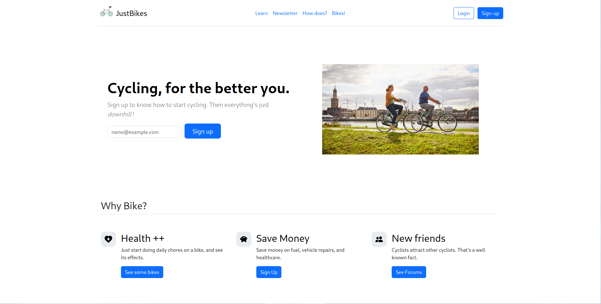
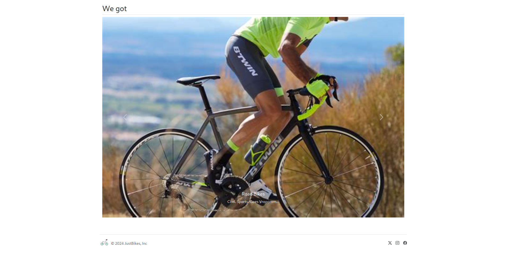
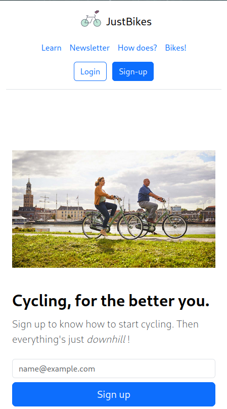
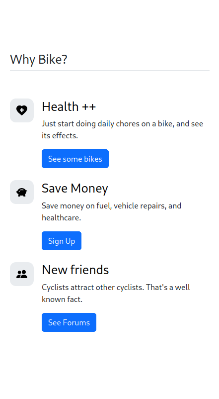
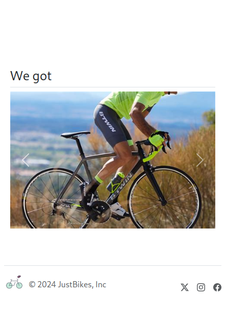

# Basic Web Development Tasks

These were the tasks assigned to me during my summer internship 2024 at [Tech_Octanet Services Pvt Ltd](https://octanet.in). 

## 1) Landing Page Design

I used bootstrap for this, just because it was simple enough for me (a complete beginner), and looked professional even without much coding due to examples and prebuilt assets on the bootstrap website.
Plus the fact that it was mobile friendly by default.

** It is just a design, the buttons don't work. **

Landing page Code: [Landing Page](octanet_justbikes_landing_page/pages/landing_page.html)

### Screenshots

**On Desktop**

**On Smaller screens (SmartPhones)**

## 2) A To-do list app

For this, I went with Svelte and TailwindCSS.

Again, I picked Svelte because it was easy to pick up for beginners, and the fact that MDN had an tutorial for a To-Do app using Svelte.

I just installed npm, and using the Sveltekit guides on Svelte and TailwindCSS's websites, I set up the basic layout of the app.

