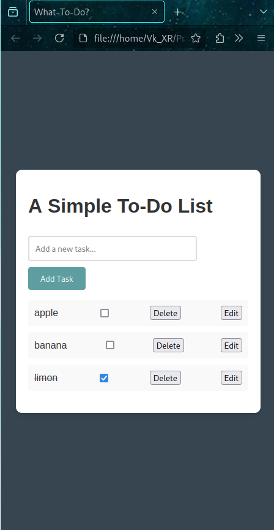
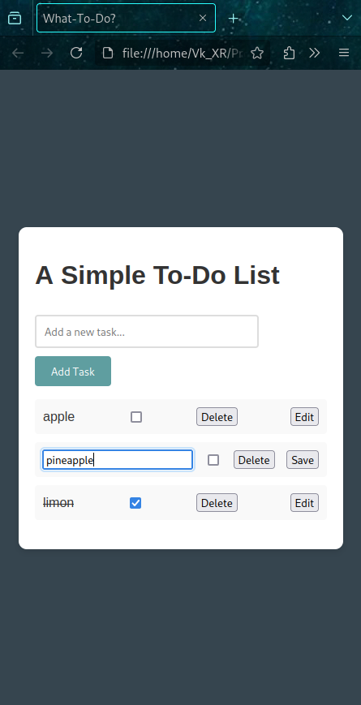
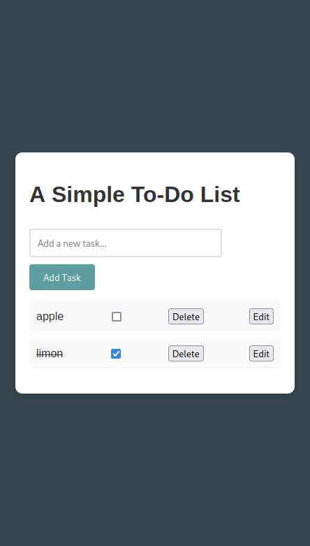

# Basic Web Development Tasks

These were the tasks assigned to me during my summer internship 2024 at [Tech_Octanet Services Pvt Ltd](https://octanet.in). 

## 1) Landing Page Design

I used bootstrap for this, just because it was simple enough for me (a complete beginner), and looked professional even without much coding due to examples and prebuilt assets on the bootstrap website.
Plus the fact that it was mobile friendly by default.

** It is just a design, the buttons don't work. **

Landing page Code: [Landing Page](octanet_justbikes_landing_page/pages/landing_page.html)

### Screenshots

**On Desktop**

**On Smaller screens (SmartPhones)**

## 2) A Simple To-do list app

For this, I chose to go with Vanilla JS, HTML and CSS combination, just to understand the workings of a simple website like this in detail.

I took the help of [this article](https://hackr.io/blog/how-to-create-a-javascript-to-do-list). It had some problems, which I solved and changed the background to just be plain gray. I also chose to add local storage function so that tasks are not deleted once the page is refreshed.

### Screenshots

**Similar on phone and desktop**

